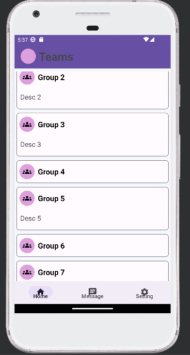

# TeamsGroupList
<h3>Teams group list project includes: </h3>

--> Top bar

--> Recyler view to show list of groups which on clicking will expand to show the description of the respective group

--> Static bottom navigation bar

 Language used: Kotlin 
  Framework: View Based (XML)
  Note: View Binding used 

<h3>Screenshots of emulator</h3>

